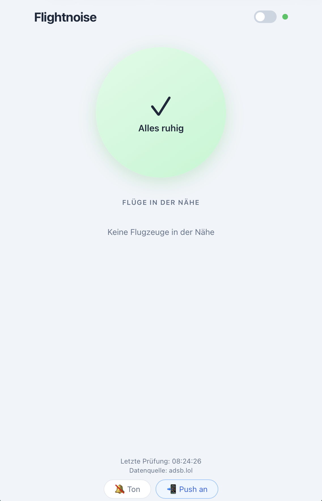

# Flightnoise

Fluglärm-Frühwarnsystem als Webapp. Warnt in Echtzeit vor Flugzeugen, die über dein Haus fliegen.

## Features

- **Echtzeit-Warnung** – Erkennt anfliegende Flugzeuge und warnt 2 Minuten im Voraus
- **Ampel-System** – Grün (ruhig), Gelb (Flugzeug nähert sich), Rot (Flugzeug über dir)
- **Push-Notifications** – Via [ntfy.sh](https://ntfy.sh) auf beliebig vielen Geräten
- **Dark Mode** – Umschaltbar per Toggle
- **iPhone-optimiert** – Als Webapp auf dem Homescreen nutzbar
- **Keine API-Keys nötig** – Nutzt frei verfügbare Flugdaten von [adsb.lol](https://adsb.lol)

## Screenshot

<p align="center">
  
</p>

## Schnellstart

```bash
# Repository klonen
git clone https://github.com/xmo111x/flightnoise.git
cd flightnoise

# Abhängigkeiten installieren
npm install

# Eigene Position in server.js eintragen
# HOME_LAT und HOME_LON anpassen

# Server starten
npm start
```

Webapp öffnen: `http://localhost:3000`

Auf dem iPhone im selben WLAN die Netzwerk-URL öffnen und via "Teilen > Zum Home-Bildschirm" als App speichern.

## Konfiguration

In `server.js` im `CONFIG`-Objekt:

| Parameter | Standard | Beschreibung |
|---|---|---|
| `HOME_LAT` / `HOME_LON` | – | Deine Position (Breitengrad/Längengrad) |
| `NOISE_RADIUS_KM` | 5 | Radius in dem Fluglärm hörbar ist |
| `SCAN_RADIUS_KM` | 75 | Scan-Radius für Flugdaten |
| `WARNING_SECONDS` | 120 | Vorwarnzeit in Sekunden |
| `MIN_ALTITUDE_M` | 50 | Unter 50m = am Boden |
| `MAX_ALTITUDE_M` | 4000 | Über 4000m = Reiseflughöhe, kaum Lärm |
| `PORT` | 3000 | Server-Port |

## Push-Notifications

1. [ntfy](https://ntfy.sh) App installieren (kostenlos, iOS & Android)
2. In der Webapp auf "Push" klicken und einen Topic-Namen vergeben
3. In der ntfy App denselben Topic abonnieren
4. Jedes Gerät hat seinen eigenen Topic – mehrere Geräte können unabhängig Push empfangen
5. Push per Klick auf "Push an" wieder deaktivieren – der Topic wird beim nächsten Mal vorgeschlagen

## Datenquellen

- **[adsb.lol](https://adsb.lol)** – Primäre Quelle (Community-driven ADS-B Daten)
- **[OpenSky Network](https://opensky-network.org)** – Fallback

## Technik

- Node.js + Express
- Server-Sent Events (SSE) für Echtzeit-Updates
- Geomathe­matik zur Überflug-Vorhersage (nächster Annäherungspunkt, Ein-/Austrittszeit Lärmzone)
- Rein clientseitige Countdown-Interpolation für flüssige Anzeige

## Lizenz

Apache License 2.0 – siehe [LICENSE](LICENSE)
